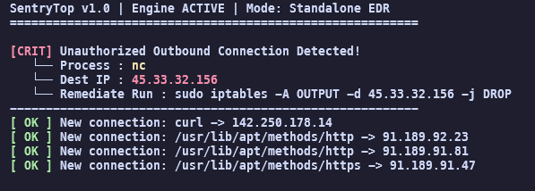

# SentryTop v1.0.0

SentryTop is a standalone kernel-polling Linux EDR agent designed to detect active beacons, reverse shells, and unauthorized data exfiltration.

---

## Documentation

*   [Installation Guide](docs/INSTALLATION.md)
*   [Deployment & Systemd](docs/DEPLOYMENT.md)
*   [Threat Modeling](docs/THREAT_MODELING.md)
*   [API Reference](docs/API_REFERENCE.md)

This is a functional security tool that monitors the live state of the Linux networking stack via the /proc filesystem.

---

### **Detection Example**



*A standard `nc` beacon reaching out to a known malicious IP (45.33.32.156) is flagged in real-time, while standard system connections are validated and passed.*

---

## Architecture

SentryTop operates as a two-stage pipeline:

```text
[ Kernel Space ]
      |
      v
[ /proc Filesystem ] <--- [ C Collector (Sensor) ]
      |                         |
      | (JSON Telemetry Stream) v
      |
[ Java Engine (Correlator) ] <--- [ Intel DB / Config ]
      |
      v
[ Security Alerts (Stdout/Logs) ]
```

*   **Sensor (C)**: Low-level polling of `/proc/net` files. Resolves socket inodes to process paths by walking the `/proc/[pid]/fd` tree.
*   **Correlator (Java 21)**: Processes telemetry using high-concurrency virtual threads. Enriches data with GeoIP and Threat Intel.

---

## Threat Detection Logic

SentryTop evaluates every connection against three primary engines:
1.  **Intel Match**: Checks destination IPs against known C2 and Botnet databases.
2.  **Suspicious Ports**: Identifies outbound traffic on high-risk ports (e.g., 4444, 1337).
3.  **Behavioral Analysis**: Detects "beaconing" patterns (repetitive high-frequency connections) common in reverse shells.

For more details, see [THREAT_MODELING.md](docs/THREAT_MODELING.md).

---

## FAQ

**Q: Why does the collector need sudo?**
A: Accessing `/proc/[pid]/fd` for processes owned by other users requires root privileges or specific capabilities (`CAP_SYS_PTRACE`).

**Q: Can I run this in a container?**
A: Yes, but you must use `--net=host` and mount the host's `/proc` filesystem. See the [Dockerfile](Dockerfile) for an example.

**Q: What is the performance impact?**
A: Minimal. The C collector is optimized for low CPU usage, and the Java engine uses virtual threads to handle high event volumes with very little RAM.

---

## Troubleshooting

*   **No output**: Ensure the collector is running as root and that there is active network traffic. Check `/proc/net/tcp` to see if connections exist.
*   **High CPU usage**: Increase the polling interval in `assets/config.json`.
*   **Java Errors**: Ensure you are using OpenJDK 21+. Virtual threads are not available in older versions.

## Build Requirements
Tested on Debian/Ubuntu and WSL2.
`sudo apt update && sudo apt install -y build-essential gcc openjdk-21-jdk maven`

## Installation & Usage
1. Clone the repository:
   `git clone https://github.com/link-rm-rf/sentrytop.git`
2. Enter the directory:
   `cd sentrytop`
3. Run the pipeline (Requires sudo for the C sensor):
   `./scripts/sentrytop`

## Security & Performance
* **Zero Cloud Dependency:** Operates entirely offline for maximum privacy.
* **Minimal Overhead:** Optimized C collector and Java Loom virtual threads ensure near real-time processing.
* **Least Privilege:** Sensor runs as ROOT while the engine runs as USER.
